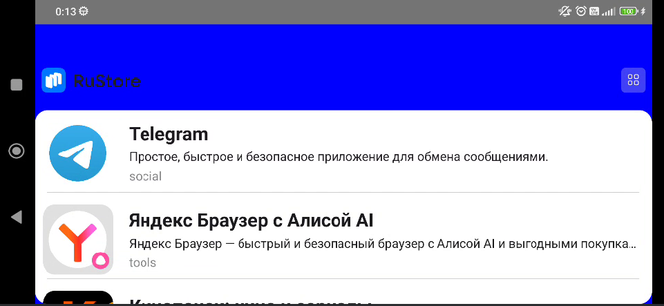
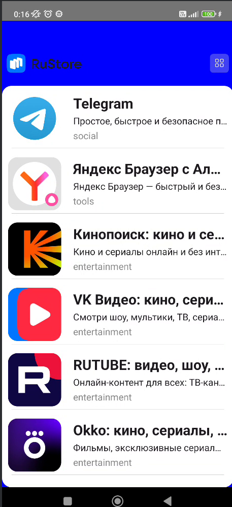

1. Изменена архитектура приложения на MVVM 

2. Интегрированы полные карточки

3. Вставлены заглушки при ошибке

4. Поворот экрана при отсутствии интернета переживает

5. Возвращение из полной карточки при отсутствии интернета тоже 
